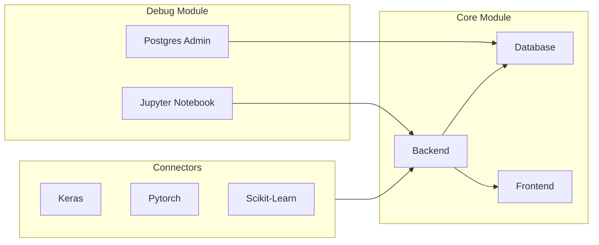
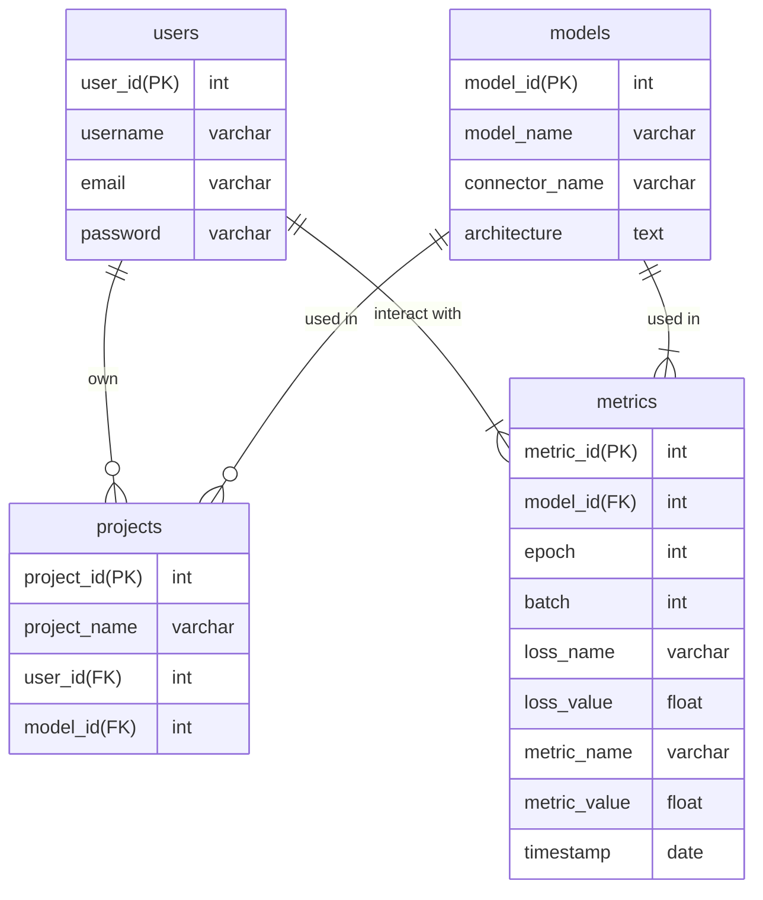
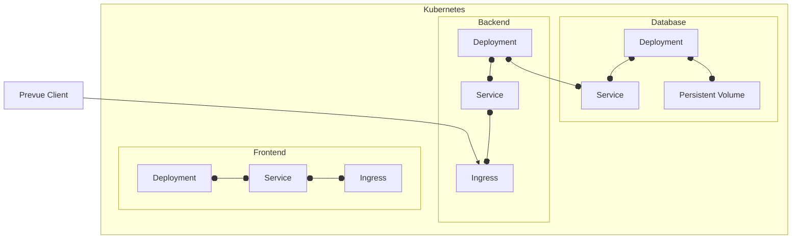

# Prevue

Tool for visualization of training and testing machine learning models.

## Design

### Architecture



### Database design

This Mermaid diagram represents the database schema with the tables `users`, `projects`, `models`, and `metrics`. The primary keys are denoted with (PK) and foreign keys with (FK). The relationships between the tables are represented by lines connecting them. For example, users can own multiple projects, and each project is associated with a single user through the `user_id` foreign key. Similarly, models are used in multiple projects, and each project can use a single model, connected through the `model_id` foreign key. Users and models can also have interactions with metrics, which are represented by lines connecting them.

Note that the timestamp is defined in UTC. 



### Deployment



## Development

Prerequisites:

- tilt
- docker
- kind

### Start development environment

```bash
tilt up
```

### Stop development environment

```bash
tilt down
```

### Connect to backend using python client

```python
from prevue import PrevueKerasCallback

callback = PrevueKerasCallback(
    connector_name="keras",
    project_name="test",
    uid="test",
    url="http://localhost:8080"
)

model.fit(x_train, y_train, epochs=5, callbacks=[callback])
```

### Connect to backend using docker

Build backend:

```bash
 docker build . -t backend 
```

Run docker build of backend 

```bash 
docker run -p 8080:8080 backend:latest
```