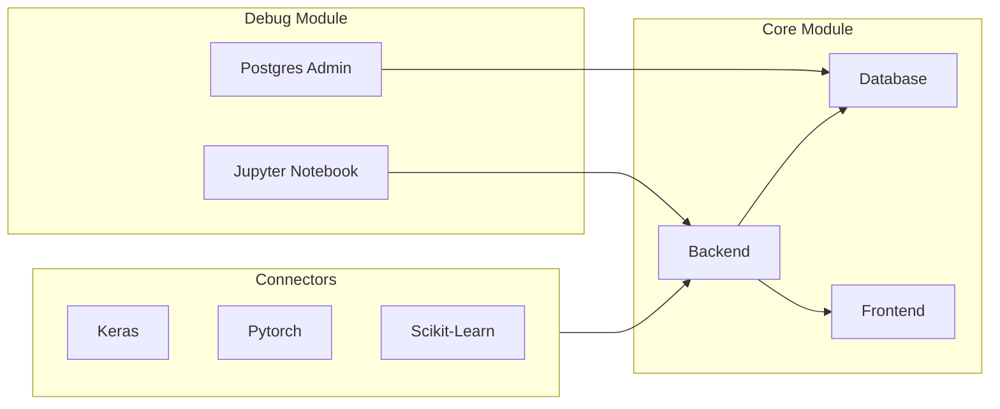
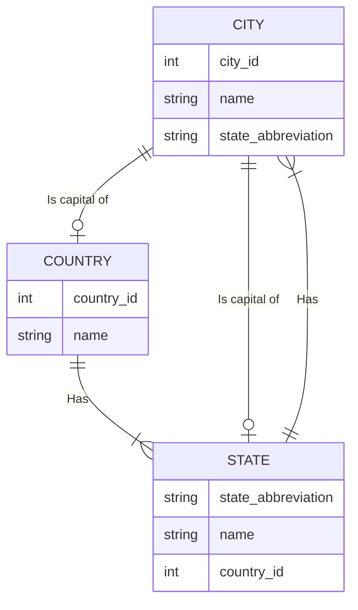
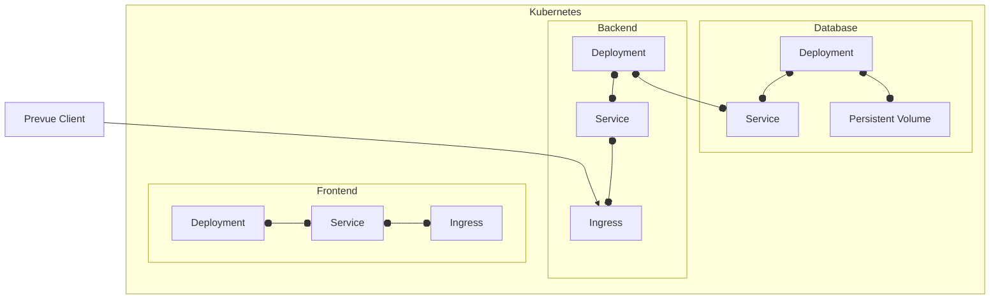

# Prevue

Tool for visualization of training and testing machine learning models.

## Design

### Architecture



### Database design



### Deployment



## Development

Prerequisites:

- tilt
- docker
- kind

### Start development environment

```bash
tilt up
```

### Stop development environment

```bash
tilt down
```

### Connect to backend using python client

```python
from prevue import PrevueKerasCallback

callback = PrevueKerasCallback(
    connector_name="keras",
    project_name="test",
    uid="test",
    url="http://localhost:8080"
)

model.fit(x_train, y_train, epochs=5, callbacks=[callback])
```

### Connect to backend using docker

Build backend:

```bash
 docker build . -t backend 
```

Run docker build of backend 

```bash 
docker run -p 8080:8080 backend:latest
```